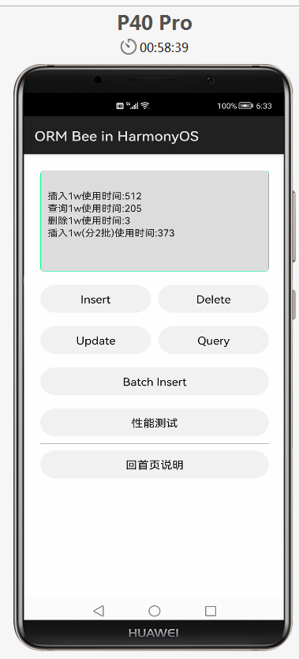

## ORM Bee Demo in HarmonyOS

Android、HarmonyOS关系数据库都是用SQLite数据库.  
希望通过ORM工具,在两种环境能使用同一套代码访问DB.  
**Bee可用于Android、HarmonyOS环境访问SQLite数据库,专门对两套环境作了优化(V1.17)**  
在**Android和Harmony两个环境**,可以用**同一套Bee代码访问DB**  

**ORM Bee 简单易用，文件小，性能好；同时支持 Android 和 Harmony，还支持 JDBC (可在 JavaWeb 等开发中使用)。**

在 **Android和Harmony两个环境**,可以用**同一套Bee代码访问DB**, 提高代码重用，节省人力物。

Bee，互联网新时代的 Java ORM 工具，**更快、更简单、更自动**，**开发速度快，运行快，更智能**！

**Bee** 网址:  
https://github.com/automvc/bee  
**Bee在gitee** 的网址:  
https://gitee.com/automvc/bee  

### 使用说明

1.点击Insert按钮，添加数据到数据库，并在文本框中显示。

2.点击Update按钮，修改数据。

3.点击Delete按钮，删除数据。

4.点击Query按钮，查询数据。

5.点击Batch Insert按钮，批量添加数据。

6.各按钮演示说明   
Insert : 插入一条记录,然后显示所有记录;   
Delete : 删除第1和第2条记录;   
Update : 修改第一条记录;   
Query  : 查询第2条开始的一页数据(5条);   
性能测试 : 测试操作1万条数据的各项性能;   
回首页说明:跳转到首页说明.   

### 约束与限制

本示例为Bee在Harmony中使用面向对象方式操作数据库的使用Demo.   
Bee可用于Harmony,也可用于Android, 也可开发JavaWeb(JDBC),   
一个ORM工具,就可让你在各种环境中使用;   
使用Bee,在Harmony和Android两个环境,可以用同一套访问DB的代码,    
提高代码重用;节省人力物力!   

### 效果图
  
  